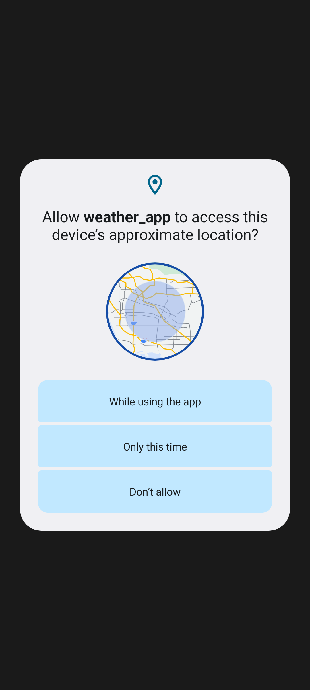
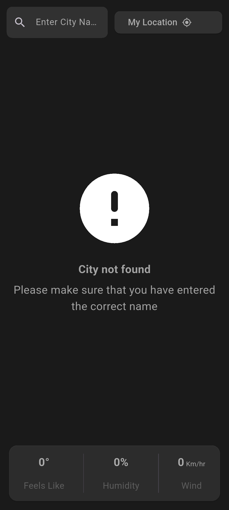
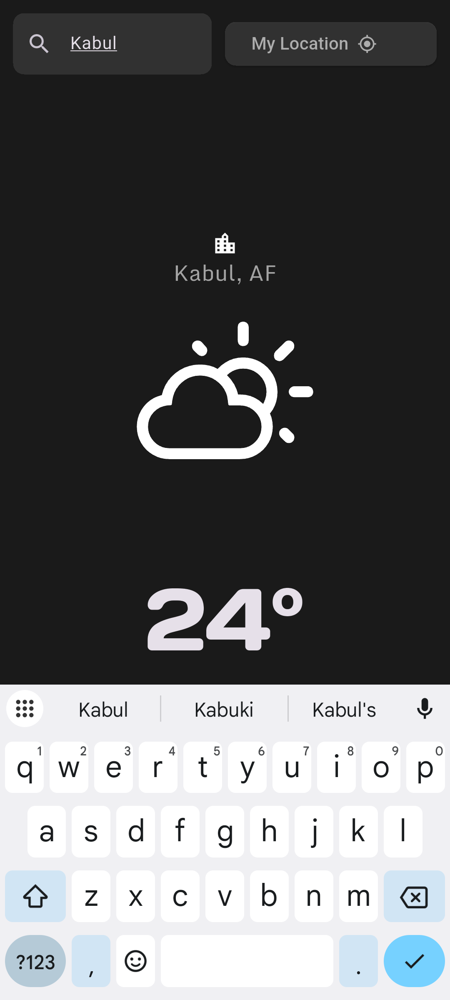
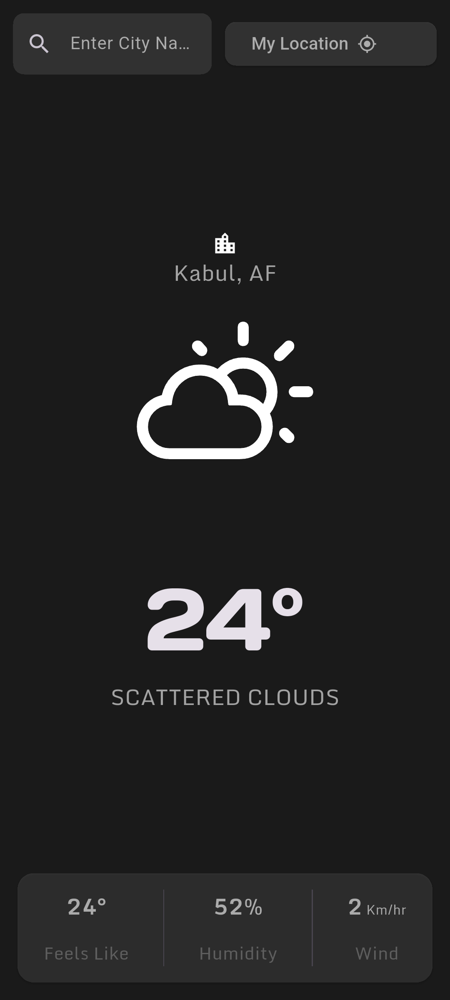

# Clime Weather App

A real-time weather application built with **Flutter**, featuring location-based forecasting and a sleek dark-themed interface. The app provides instant weather updates for your current location or any city you search for, displaying key atmospheric data like temperature, humidity, and wind speed.

## App Preview

| Asking For Location Permission | Searching For Location | Main Page | Weather Information |

<table align="center">
  <tr>
    <td align="center">
      
      <br />
      <em>Asking For Location Permission</em>
    </td>
    <td align="center">
      
      <br />
      <em>Main Page</em>
    </td>
    
  </tr>
  <tr>
    <td align="center">
      
      <br />
      <em>Searching For Location</em>
    </td>
    <td align="center">
      
      <br />
      <em>Weather Information</em>
    </td>
  </tr>
</table>

## Technologies Used

- **Flutter** - For the cross-platform UI
- **OpenWeatherMap API** - For fetching real-time weather data
- **Geolocator** - For device location tracking
- **Flutter SVG** - For crisp weather iconography

## How to run

### Prerequisites

- Flutter SDK installed ([Installation Guide](https://flutter.dev/docs/get-started/install))
- Android Studio / VS Code with Flutter extensions
- Android emulator or physical device

### Steps

1. Clone the Repository

```bash
https://github.com/WazhmaHakimi/weather_app.git
```

2. Open the project in Android Studio or any IDE that you use

3. Run this command to get all the dependencies

```bash
flutter pub get
```

4. Then run this command to run the project.

```bash
flutter run
```

## Permissions

The app requests location access to show weather for your current position. On Android and iOS, location permission must be granted for the location-based feature to work.

## API Notes

The app uses the OpenWeatherMap API. A default API key is currently included in the project for development purposes. For production use, it is recommended to move the key to a secure configuration method.
